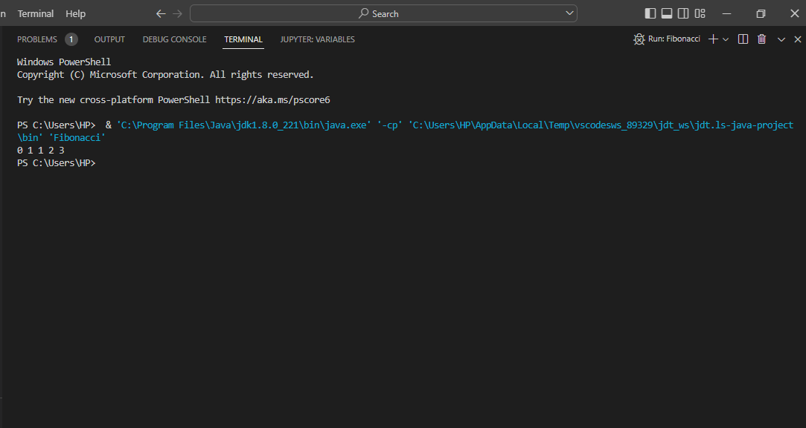
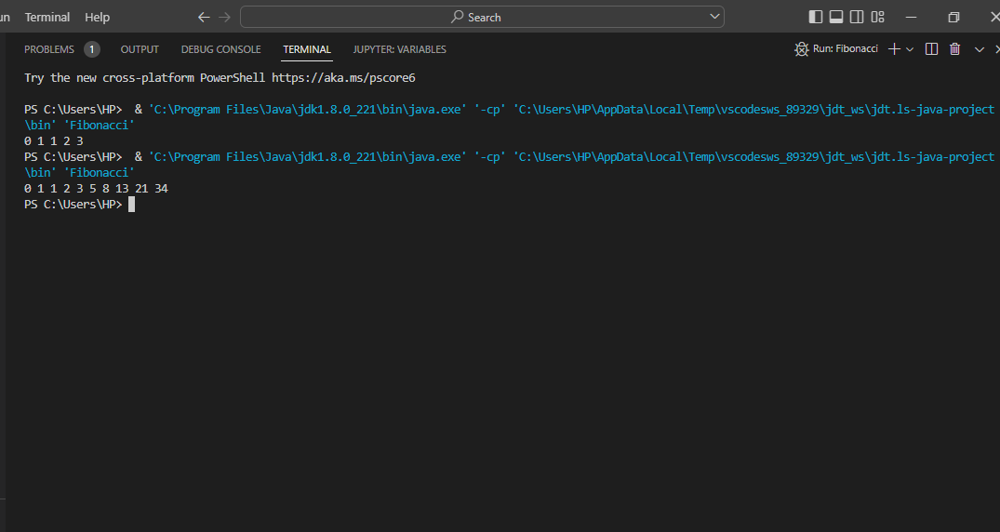
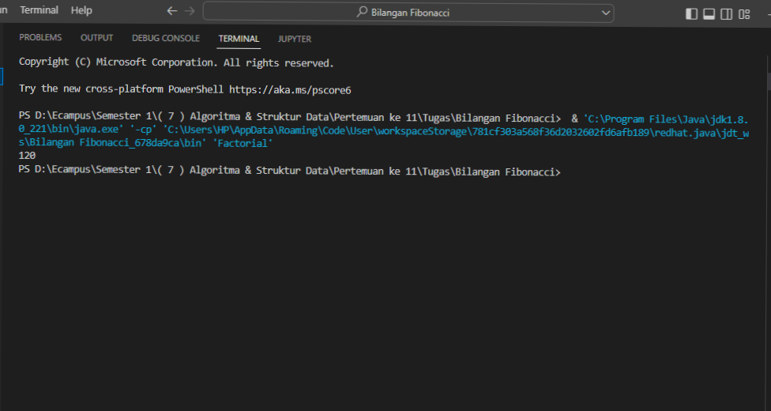

#   NAMA        = MIDUN HAKIKI
#   NIM         = 312210583
#   PRODI       = TEKNIK INFORMATIKA
#   -----------------------------------------------------------

JAVA PROGRAMMING

#   REKURSIF DI JAVA

    Rekursif merupakan teknik memanggil dirinya sendiri secara berulang-ulang sampai ada kondisi yang menghentikannya. Biasanya rekursif ini dipakai untuk sesuatu yang membutuhkan perulangan seperti faktorial. Sebelum memahami tentang rekursif di harapkan sudah lebih dahulu mengerti tentang variable dan method di java.

#   A.) Bilangan Fibonacci dengan Rekursif
Rumus matematika fibonacci :

-   Contoh Langkah yang pertama
  
    Dengan total 5 barisan
  

        public class Fibonacci {

            public static void main(String[] args) {
                for (int i = 0; i < 5; i++) {
                    int hasil = fiboRekursif(i);
                    System.out.print(hasil + " ");

                }
            }
            public static Integer fiboRekursif(int n) {
                if (n == 0) {
                    return 0;

                }
                if (n == 1) {
                    return 1;

                }
                return fiboRekursif(n - 1) + fiboRekursif(n - 2);
            }
        }

#   Hasilnya

-   Contoh Langkah yang Kedua

    Dengan total 10 Barisan

        public class Fibonacci {

            public static void main(String[] args) {
                for (int i = 0; i < 10; i++) {
                    int hasil = fiboRekursif(i);
                    System.out.print(hasil + " ");

                }
            }
            public static Integer fiboRekursif(int n) {
                if (n == 0) {
                    return 0;

                }
                if (n == 1) {
                    return 1;

                }
                return fiboRekursif(n - 1) + fiboRekursif(n - 2);
            }
        }

#   Hasilnya

#   Pembahasan :

Dalam contoh di atas method fiboRekursif(int n) memanggil dirinya sendiri dan kondisi yang menghentikan rekursifnya adalah jika n == 0 atau n == 1.

#   B.) Bilangan Factorial dengan Rekursif
Rumus matematika faktorial :

        public class Factorial {

            public static void main(String[] args) {
                int hasil = rekursif(5);
                System.out.print(hasil);
            }

            public static Integer rekursif(int n) {
                if (n == 0 || n == 1) {
                    return 1;
                }

                else {
                    return n * rekursif(n - 1);
                }
            }
        }

#   Hasilnya

#   Pembahasan
Dalam contoh di atas juga method rekursif(int n) memanggil dirinya sendiri dan kondisi yang menghentikan rekursifnya adalah jika n == 0 atau n == 1.

#   Kesimpulan
Kuncinya adalah untuk bisa membuat rekursif dari bilangan fibonacci dan faktorial dibutuhkan pengetahuan tentang rumus matematikanya, kalo hafal harusnya bisa membuat di dalam aplikasi javanya. Demikian tutorial singkat dari saya mengenai teknik rekursif di java.

#   TERIMAKASIH...
#   SALAM SEHATI...
